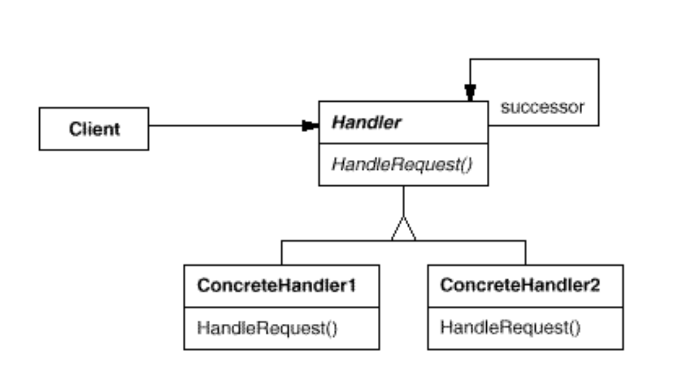
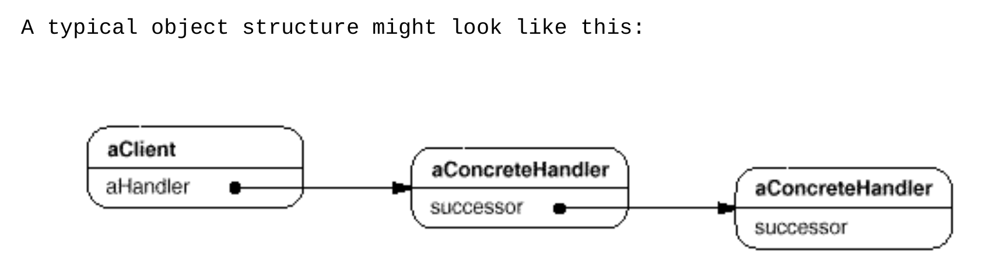

# Chain Of Responsibility
+ Intent: развязать отправителя запроса от его получателя, запрос проходит через цепочку получателей,
у которых есть шанс обработать запрос.
+ Запрос может быть обработан последовательно несколькими звеньями цепи.

[MoneyDispenser](../../../src/main/java/arbocdi/dp/behavorial/chain/MoneyDispenser.java)
  