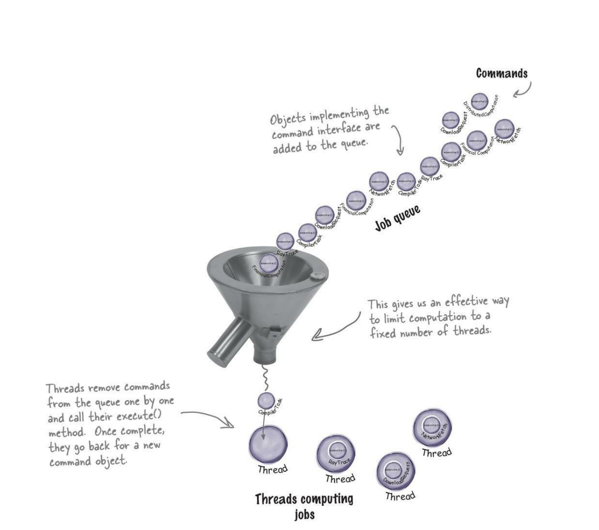
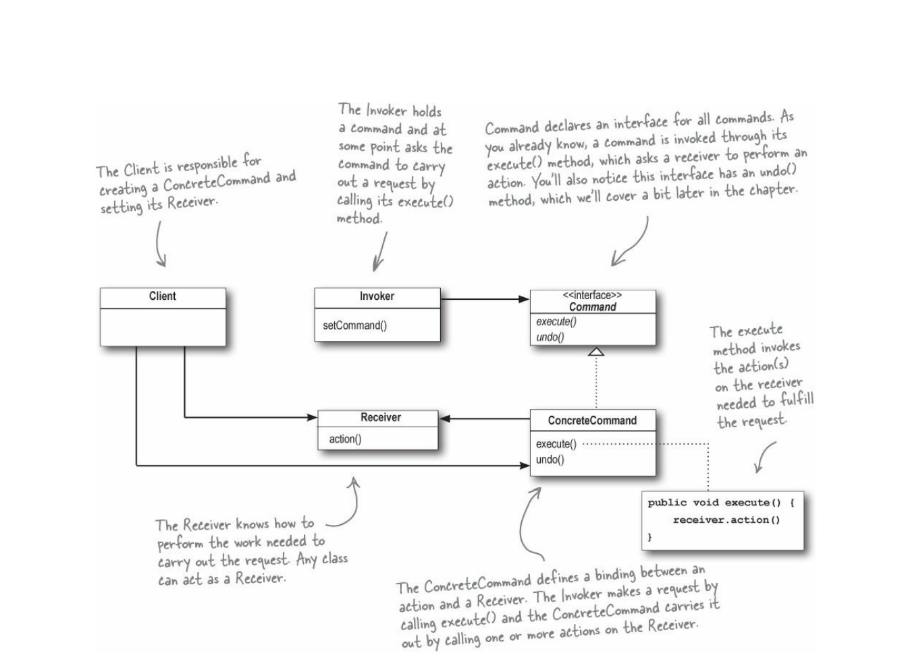

# Command
+ Intent: Инкапсулировать запрос в объекте (command), что позволит: 
  1. параметризировать объекты (invoker) запросами
  2. добавлять в очередь запросы или логгировать их
  3. поддерживать undo-операции  
  
+ Инкапсулировать запрос в объекте (команде) - команда содержит в себе receiver - рабочий класс,
    который собственно выполняет действия и набор действий, который ресивер должен выполнить.
+ Параметризировать объекты (invoker) запросами - в инвокер можно передать различные команды, которые он может выполнить.
+ Добавлять в очередь или логгировать операции - ThreadPool как раз добавляет операции в очередь,
а макросы сохраняют набор команд.

+ Поддерживать undo-операции - команда может содержать в себе предыдущее состояние, к которому можно вернуться.

+ Отличия от chain of responsibility:
  Шаблон command отправляет запросы конкретному объекту (reciever), chain - набору объектов в цепи.

+ П: Программируемый пульт с 3-мя кнопками (invoker) on/off/undo, который позволяет управлять любым устройством. 
При программировании пульта на каждую кнопку передаем команду - П: включить свет, выключить его, переключить состояние.
Команда содержит в себе receiver - собственно объект, выполняющий действия.
```java
public interface Command{
    void execute();
    void undo();
}
public class RemoteControl{
    private Command onCommand;
    private Command offCommand;
    private Command lastCommand;
    
    public void onButtonPressed(){
        onCommand.execute();
        lastCommand = onCommand;
    }
    public void ofButtonPressed(){
        offCommand.execute();
        lastCommand = offCommand;
    }
    public void undoButtonPressed(){
        lastCommand.undo();
    }
    
}
public class LightOnCommand implements Command{
    private Light light;
    
    public void execute(){
        light.on();
    }
    public void undo(){
        light.off();
    }
}
public class LightOffCommand implements Command{
    private Light light;

    public void execute(){
        light.off();
    }
    public void undo(){
        light.on();
    }
}

public class Client{
    void someMethod(){
        RemoteControl remoteControl = new RemoteControl();
        remoteControl.onCommand = new LightOnCommand();
        remoteControl.offCommand = new LightOffCommand();
        
        remoteControl.onButtonPressed();
        remoteControl.undoButtonPressed();
    }
}
```  
+ П: ThreadPool  - принимает в себя команды (runnable), которые содержат какие-то действия (receivers).
Пул не знает ничего о том кто и какие действия будет выполнять.
+ П: Interface Toolkit - кнопки и меню не знают кто и как будет выполнять действия при нажатии на них.
Они просто содержат описание этих самых кнопок и меню, а действия будет выполнять приложение, использующее
  toolkit.

