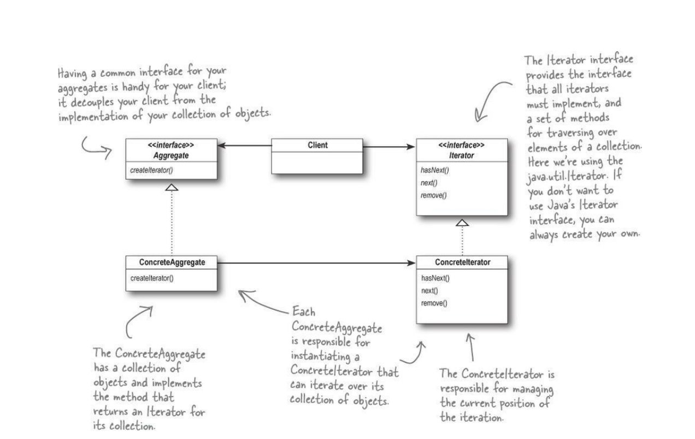

# Iterator (Cursor)

+ Intent: Предоставить последовательный доступ к элементам аггрегата 
  не раскрывая его внутреннюю структуру.
+ Consequences:
  + Упрощается класс аггрегата - ему не нужно поддерживать методы итерации.
  + Элементы сложно аггрегата можно перебирать в разной последовательности - в зависимости
    от логики итератора.
  + Итератор хранит в себе его текущую позицию-> аггрегат возможно перебирать одновременно
    несколькими итераторами.
   

[ArrayAggregate](../../../src/main/java/arbocdi/dp/behavorial/iterator/ArrayAggregate.java)