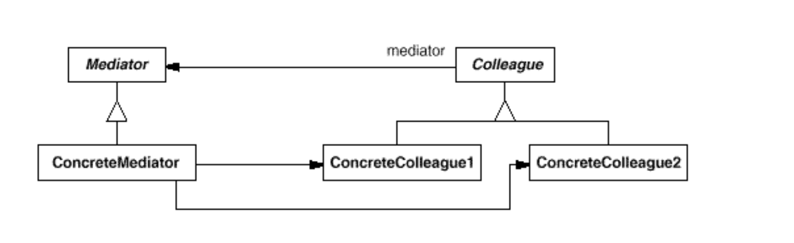
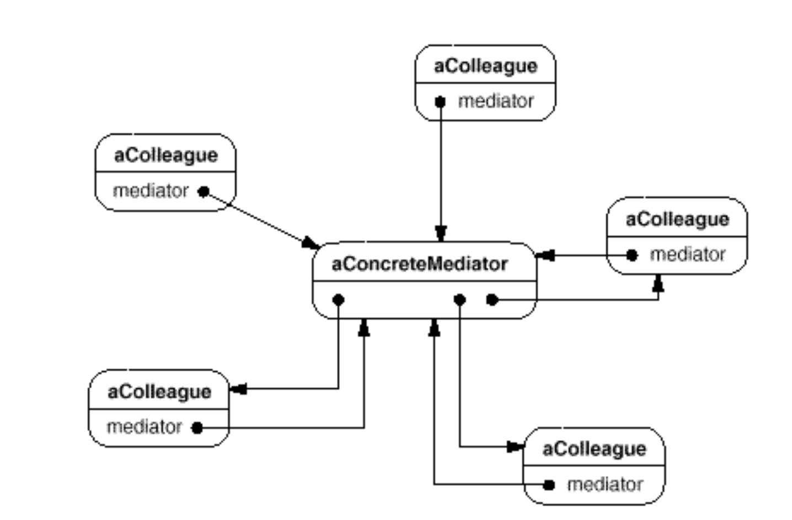

# Mediator
* Intent: Предоставить объект (mediator), посредством которого будут взаимодействовать другие объекты системы (colleague).
* When to use:
  + Использовать если нужна централизация взаимодействия и само взаимодействие сложное.
* Плюсы:
  + Разделяет коллег друг от друга посредством медиатора.
  + Коллеги упрощаются.
  + Добавление новых коллег простое.
  + Абстрагирует взаимодействие коллег - медиатор хранит в себе логику взаимодействия.
  + Централизует взаимодействие между коллегами.
  + Позволяет заменить связь между объектами (Colleague) многие ко многим через один ко многим (через mediator).

* Минусы:
  + Логика медиатора может стать довольно сложной.
* П: чат

[Chat Example](../../../src/main/java/arbocdi/dp/behavorial/mediator/Chat.java)
  