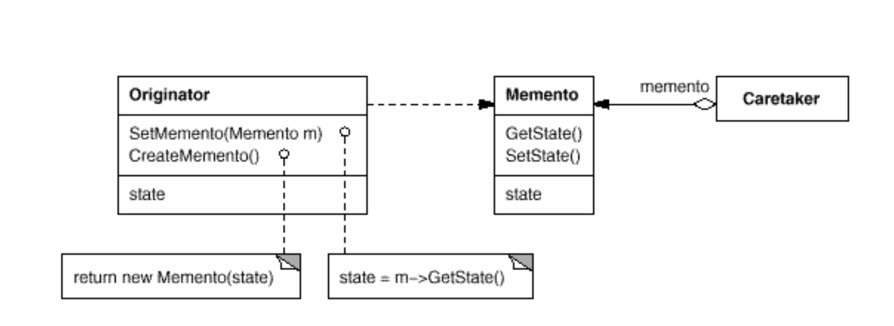
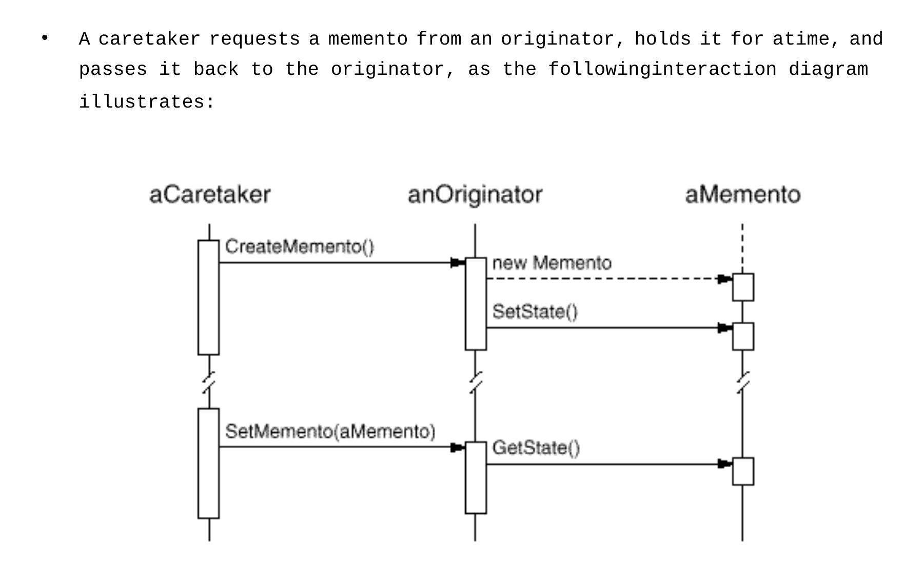

# Memento (Token)
* Intent: Не нарушая инкапсуляции получить внутреннее состояние объекта для того,
  чтобы позже иметь возможность вернуть объект к этому состоянию.
* Use when:
  + Нужно уметь возвращать объект в предыдущее состояние.
* П: Кнопка отменить в редакторах, сохранение прохождения в играх, откат транзакций.    
* Participants:
  + Memento (собственно состояние)
    + Хранит внутреннее состояние объекта.
    + Доступ к этому состоянию имеет только Originator (Не нарушая инкапсуляции!). Состояние скрыто в приватных полях.
  + Originator (объект, чье состояние сохраняется)
    + Создает Memento (передавая ему свое состояние).
    + Может вернуться к состоянию, записанному в Memento.  
  + Caretaker (опекун)
    + Хранит в себе memento.
    + Не имеет доступа к содержимому memento.
    + По запросу клиента сохраняет\восстанавливает состояние originator.
    

[Notepad Example](../../../src/main/java/arbocdi/dp/behavorial/memento/Notepad.java)

