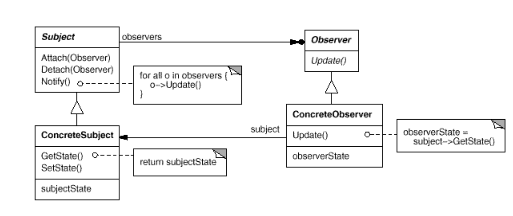
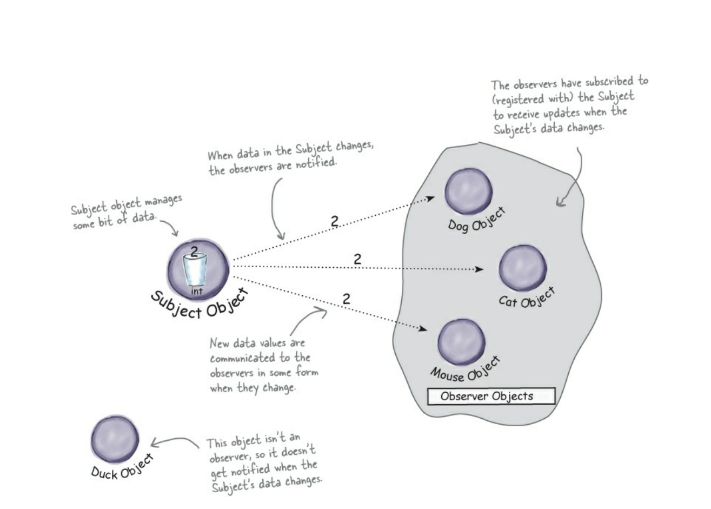

# Observer (Dependents, Publish-Subscribe) - Наблюдатель
* Intent: Реализовать зависимость один-ко-многим так, чтобы при изменении объекта (subject)
  зависимые объекты (observers) обновлялись автоматически.
* П: Подписки на новостные рассылки, подписки в соц сетях, GUI реагирующий на изменение данных в бд.
* Vs Mediator:
  + Медиатор - это объект посредством которого комуницируют другие объекты, наблюдатель имеет другую цель - 
    уведомить зависимые объекты об изменении состояния subject.
    
  

[Topic Example](../../../src/main/java/arbocdi/dp/behavorial/observer/Topic.java)
