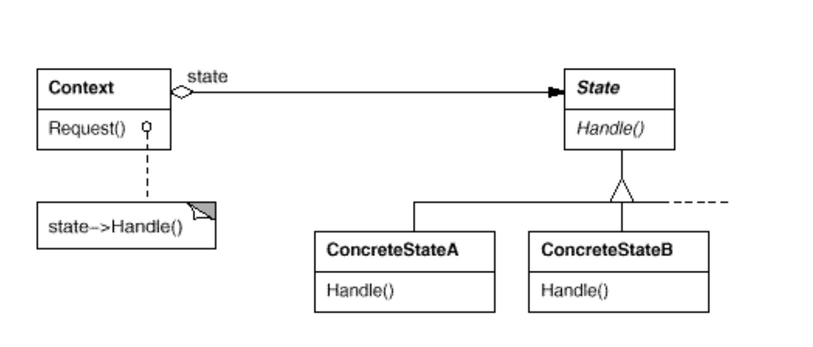
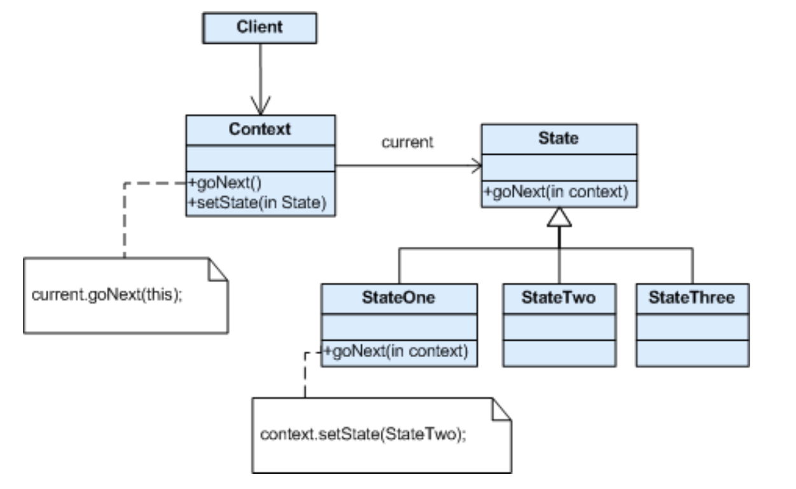
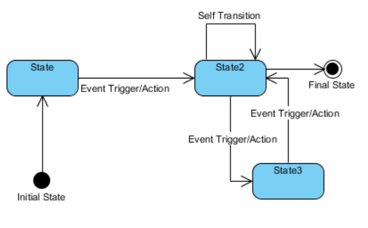
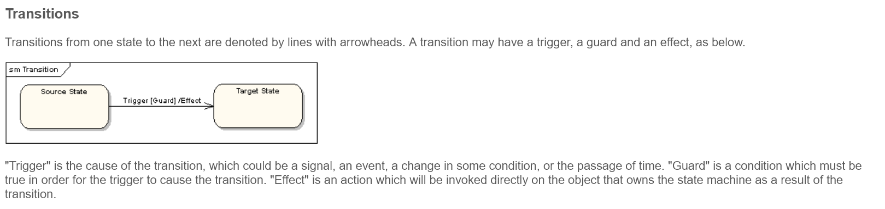
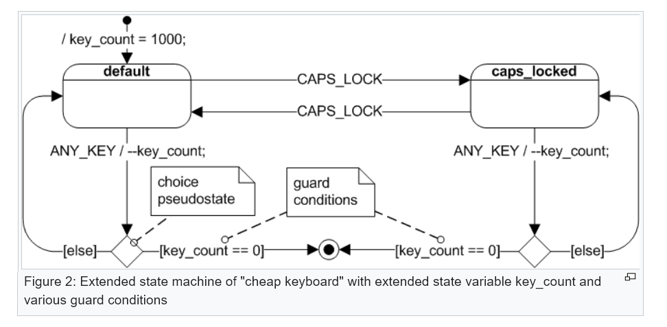

# State
* Intent: Объект (context) изменяет свое поведение при измненении внутреннего состояния (state).
  При изменении состояния кажется, что context изменил свой класс.
* П: Дверь может быть заперта, закрыта и открыта. В зависимости от состояния дверь по-разному реагирует на команды.  
* Плюсы:
  + Вся логика, присущая конкретному состоянию описывается в отдельном классе (нет кучи ветвлений в context!).
  + Защищает от "нецелостных" изменений состояния - состояние определяется одной переменной (текущим состоянием)
    в context, а не их набором.
  + Добавлять новые состояния просто.
  + Если состояния не содержат полей экземпляра, то они могут быть синглтонами.  
* Минусы:
  + Количество классов увеличивается (один класс на каждое состояние).
* Диаграмма классов:
  + Context - объект, с которым взаимодействуют клиенты. Содержит в себе текущее состояние.
  + State - содержит в себе логику, соответствующую этому состоянию.
    
  
  
  + в метод handle() может передаваться context, что позволяет state менять состояние context:
    
  

* UML-диаграмма машины состояний:
  + Event Trigger - запрос, приводящий к смене состояния.
  + Action - действие, выполняемое при смене состояния.
  + State - собственно состояние.
    
  
  
  

[Door Example](../../../src/main/java/arbocdi/dp/behavorial/state/DoorState.java)
