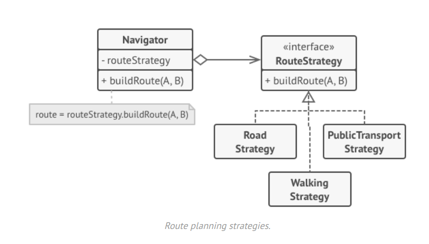
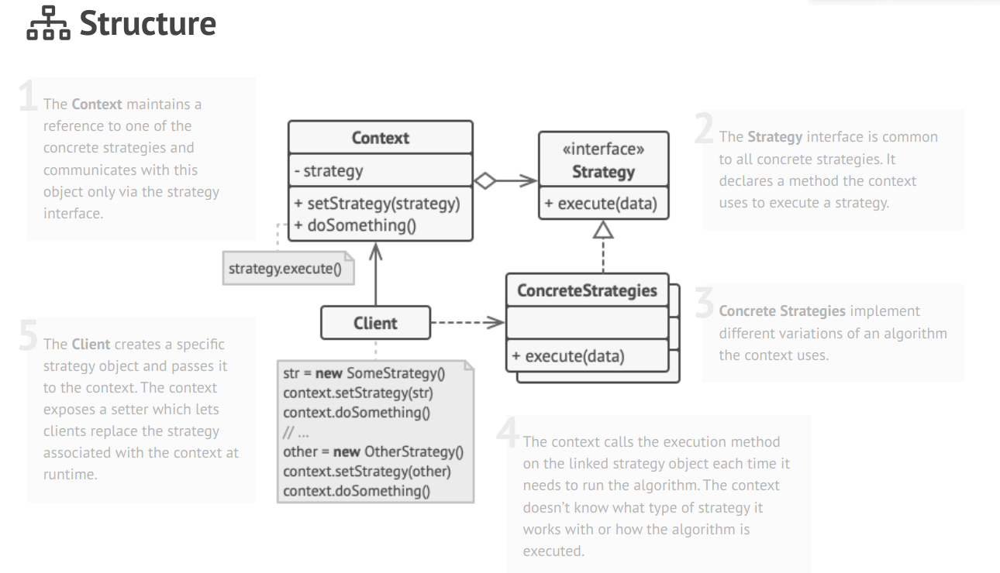

# Strategy (Policy)
* Intent: Инкапсулировать каждый алгоритм (strategy) из семейства алгоритмов в отдельном классе и сделать их
  взаимозаменяемыми. 
* Особенности:
  + Стратегия позволяет изменять алгоритмы не зависимо от клиентов, которые используют их.
  + Все алгоритмы семейства делают одно и тоже, но по-разному. (П: сортировка массива разными способами).
  + Желаемый алгоритм передается как параметр в Context (или же содержится в нем как поле).
* Недостатки:
  + Клиент должен знать какие стратегии есть и как их использовать.
  + Общее число классов возрастает.  
  + Контекст может хранить множество параметров и не все они будут использоваться всеми стратегиями.  
* Когда использовать:
  + Несколько классов имеют общий интерфейс, делают одно и то же и различаются лишь внутренним алгоритмом - стратегия как раз позволяет
    изменить поведение в рантайме.
  + В зависимости от контекста нужно использовать разные алгоритмы, решающие одну и ту же задачу.
    (П: в зависимости от сконфигурированного хранилища использовать нужный тип репозитория в Spring)
  + Если класс решает задачу множеством способов, то можно выделить эти способы в стратегии и упростить
    код исходного класса. П: Планировка маршрута - в начале были только автодороги, потом добавились
    маршруты для пешеходов, потом общественный транспорт - код такого класса станет очень запутанным.
    
    

* П: Разные реализации интерфейса бина в спринг (например разные хранилища данных).

    

[Operation Example](../../../src/main/java/arbocdi/dp/behavorial/strategy)