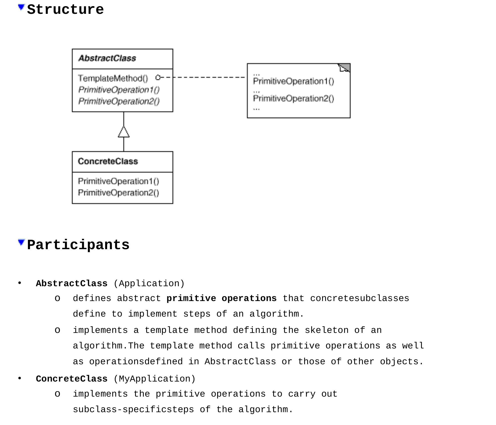

# Template Method
* Intent: Определить скелет алгоритма позволяя подклассам переопределять
некоторые шаги не изменяя при этом структуру алгоритма.
* Когда применять:
  + Когда можно выделить общее поведение (template method) у набора классов.
  + Чтобы определить алгоритм и разрешить подклассам менять только некоторые
    его шаги (open-closed principle).
  + Когда таким методом можно уменьшить дублирование кода.  
* Виды операций, которые вызывает template method:
  + concrete operations - определены в базовом классе.
  + abstract operations - абстрактные операции базового класса,
    ДОЛЖНЫ БЫТЬ переопределены подклассами.
  + hooks - определены в базовом классе и имеют пустую реализацию,
    МОГУТ БЫТЬ переопределены подклассами.
* Hollywood Principle - dont call us, we call u. Базовый класс в template method
  вызывает методы подклассов, а не наоборот. Некая инверсия контроля.
* П: строительство дома может быть шаблонным методом: в начале возводим фундамент,
  потом строим стены, окна и крышу. Порядок действий всегда один, а 
  конкретные операции (типа установка окон или строительство стен)
  могут изменяться.
* Template Method vs Strategy:
  Стратегия используется для переопределения всего алгоритма,
  Шаблонный Метод позволяет переопределить части алгоритма.
  

[HouseBuilder](../../../src/main/java/arbocdi/dp/behavorial/templateMethod/HouseBuilder.java)
