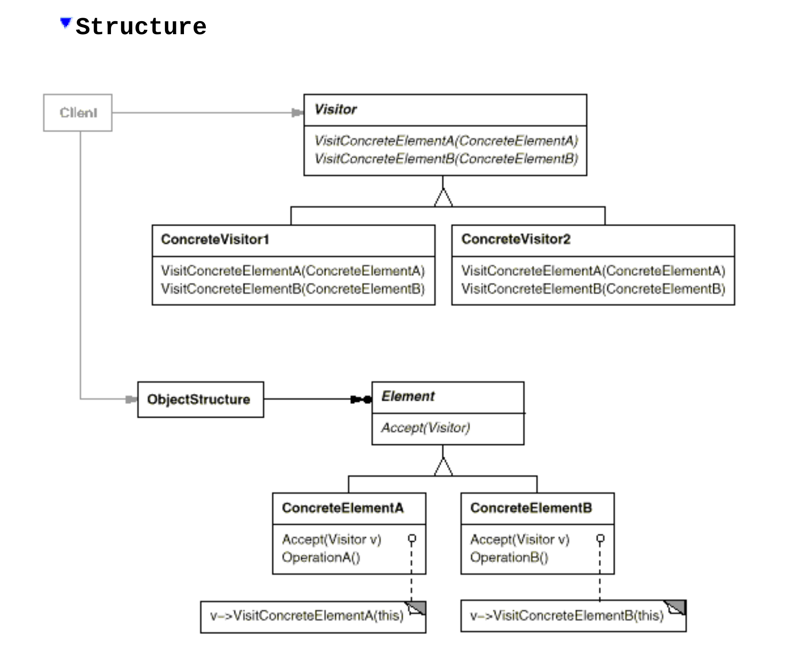
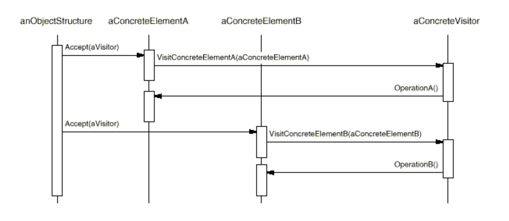

# Visitor
* Intent: добавить новую операцию к элементам некоторой структуры
не изменяя при этом классы элементов.
* Applicability:
  + Над элементами ObjectStructure требуется выполнять различные операции, реализовывать
    их внутри элементов не целесообразно.
  + Нужно предоставить возможность добавлять новые операции к элементам не
    изменяя при этом классы элементов (например библиотека с поддержкой посетителя).

* Participants:
  + Visitor определяет операцию VisitConcreteElementA,... для каждого конкретного
    подкласса Element (что позволяет использовать свойства конкретного элемента).
  + Element определяет операцию Accept(Visitor v) в которой вызывает реализацию метода
    visit() для данного конкретного элемента (VisitConcreteElementA).
  + ObjectStructure агрегирует в себе элементы:
    + ДОЖЕН уметь перебирать свои элементы
    + МОЖЕТ предоставить метод для посещения своих элементов.
* Consequences:
  + Добавление новых операций простое - для этого нужно лишь создать новый тип посетителя
    (open-closed principle соблюдается).
  + Сами элементы становятся проще, а новые операции над ними добавляются посетителями
    (open-closed principle соблюдается).
  + Сложно добавить новый ConcreteElement: возможно нужно будет дорабатывать все visitors.
  + Посетители могут накапливать состояние по мере посещения элементов, без посетителя
    это состояние нужно было бы передавать от элемента к элементу и добавлять новый 
    метод в элементы для работы с этим состоянием (П: получение строкового представления элементов).
  + Нарушается инкапсуляция элементов - посетитель должен иметь достаточный доступ к 
    элементам для выполнения своих функций.
* Related patterns:
  + Composite - может выступать в качестве ObjectStructure.
  + Iterator - с его помощью тоже можно перебрать все элементы и что-то с ними сделать,
    в отличии от посетителя итератор не различает конкретные подклассы элементов.

[ShoppingCartVisitor](../../../src/main/java/arbocdi/dp/behavorial/visitor)

