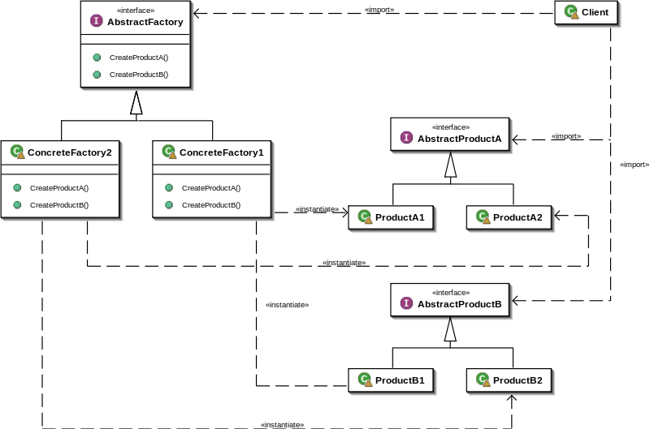
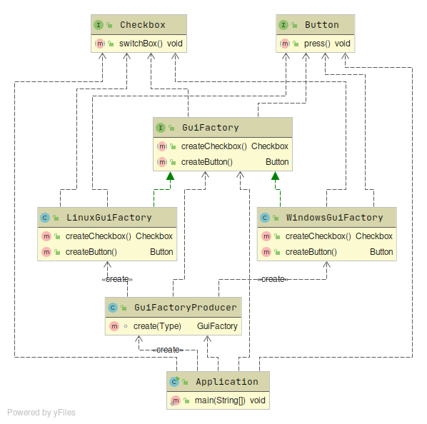

# Abstract Factory
* Создает семейство Product разных типов (общего супертипа нет)
* Когда использовать:
  + Требуется создавать набор связанных (сгруппированных) продуктов
  + Требуется спрятать логику их создания от клиента
  + Хотим заставить клиента использовать абстракции, вместо конкретных продуктов
  + Требуется отделить логику создания Product от них самих  
* Consequences
  + Достигаем поставленных задач
  + Поддержка нового типа product требует доработки интерфейса и реализаций
  
  
  
* Пример реализации
  
  [AbstractFactory example](../../../src/main/java/arbocdi/dp/creational/abstractFactory/Application.java)

  