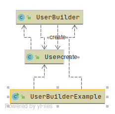

# Builder
* When to use:
  + Требуется отделить логику создания объекта от него самого,
    процесс создания должен повзолять создавать объекты с разными свойствами.
  + Хорошо подходит для создания immutable-объектов.
  + Хорошо подходит для создания сложных объектов (передавать
    10+ параметров в конструктор не удобно).  
* Отличие от Factory Method:
  + Фабрика возвращает предопределенный объект, передавать множество параметров в нее не удобно.
* Плюсы:
  + Контролируем сам процесс создания (например делаем какие-то доп. проверки).  
* Минусы:    
  + Клиенту нужно более широкое знание предметной области (в отличии от фабрики)
  + Приводит к некоторому дублированию кода    
* П: StringBuilder.append(),
* Упрощенный пример:

[userBuilder](../../../src/main/java/arbocdi/dp/creational/builder/UserBuilderExample.java)