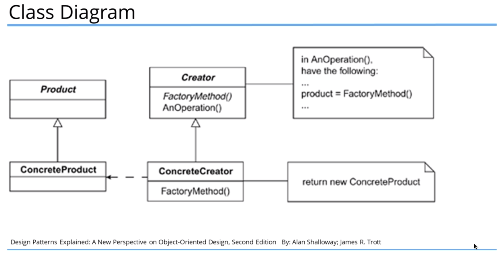
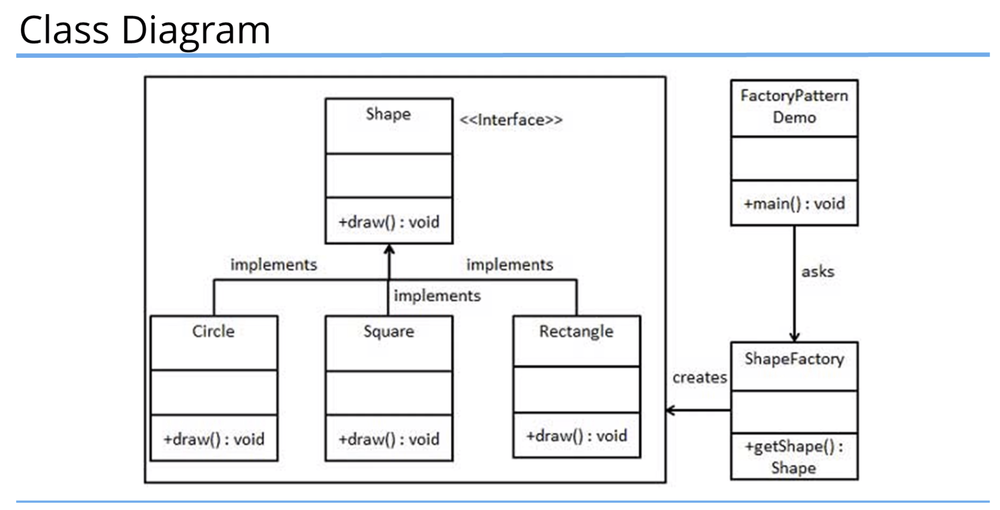

# Factory Method
* Отличия от Abstract Factory:
  + Factory Method возвращает продукт одного супертипа, Abstract Factory возвращает family связанных продуктов.
* Компоненты:
  + Creator - супертип, создает объекты Product
  + Product - супертип создаваемых объектов
* Когда использовать:
  - хотим спрятать логику создания объекта от клиента (например она сложная)
  - хотим заставить клиента работать с абстракцией 
  - хотим отделить логику создания Product от него самого
* Solution:
  + Define an interface for creating an object, but let subclasses of that interface decide which class to instantiate.
  
* Abstract Creator - наиболее строгая реализация
  + Для каждого типа Product создается свой Creator
  
  

  [AbstractCreator example](../../../src/main/java/arbocdi/dp/creational/factoryMethod/AbstractCreator.java)

* Concrete Creator - одна фабрика создает всю иерархию Product.
  + Метод создания надо дорабатывать для новых подклассов Product
  + Клиент может создавать объекты не зная конкретный тип Product
  
  
  
  [ConcreteCreator example](../../../src/main/java/arbocdi/dp/creational/factoryMethod/ConcreteCreator.java)

* Static Creator - аналог предыдущего, только метод создания статический.
