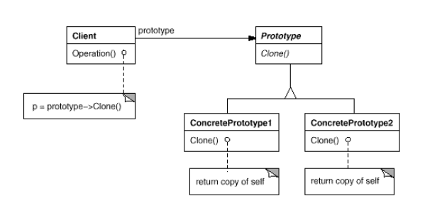

# Prototype
* Intent:
  + Прототип указывает тип создаваемых объектов и их свойства, 
    сами объекты создаются клонированием прототипа.
* When to use:
  + Создание объектов дорогое (П: для создания объекта нужне сложный запрос в бд), но уже есть объекты с соотв.
    свойствами.
  + Создание объектов программно-сложное, писать иерархию фабрик,
    либо передавать в них доп параметры не очень хочется.
  + Клиент даже не знает, какой конкретно класс ему нужно склонировать. 
* Особенности:    
  + Используем клонирование (для shallow (поверхностный) copy) и сериализацию (deep copy).
  + Механизм клонирования осуществляют сами объекты (не зависимо от других классов)
* Недостатки:
  + Все элементы должны уметь клонировать себя.
* Structure: клиент отправляет команду на клонирование прототипу.

* Недостатки метода clone():
  + Возвращает shallow-copy (вложенные объекты не клонируются, ссылки на них просто копируются).
  + Не вызываются никакие конструкторы, final-поля (типа id) нельзя переопределить,
    не выполняется логика конструктора (если она есть).
  + Вся иерархия должна наследовать clonable и определять метод clone().
* Аналоги:
  * Сериализация - остается та же проблема с final-полями и не вызовом конструкторов. Работает медленнее. 
  * Copy constructor - в нем необходимо вызвать метод clone() у вложенных объектов.

[pototypeExample](../../../src/main/java/arbocdi/dp/creational/prototype/PrototypeExample.java)    