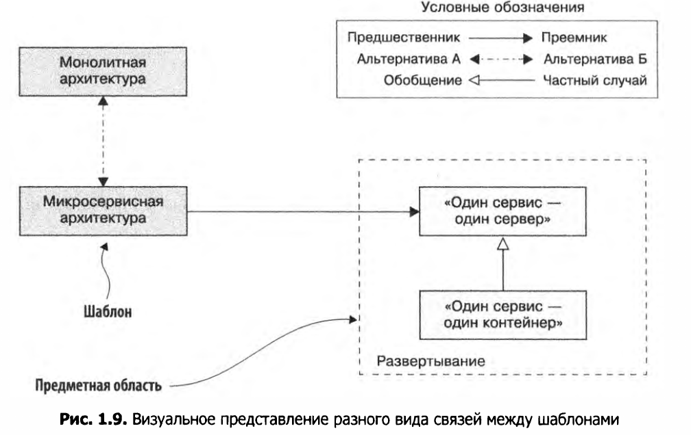
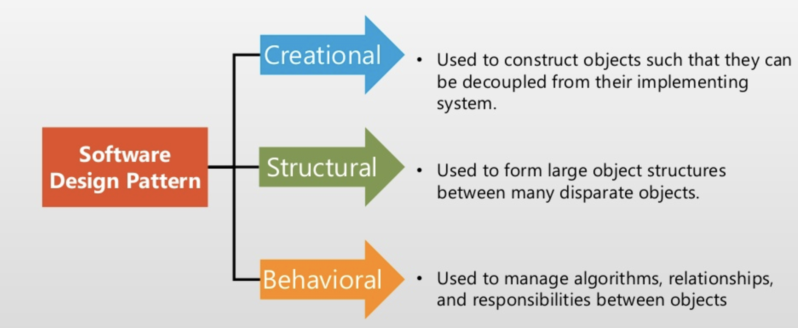
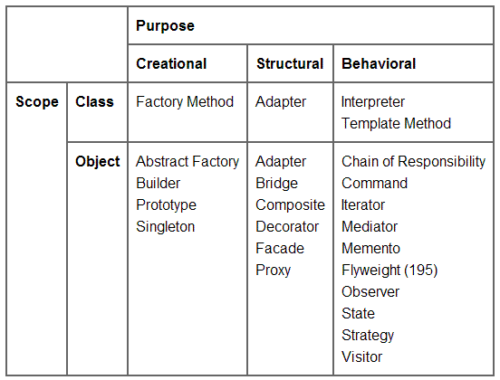
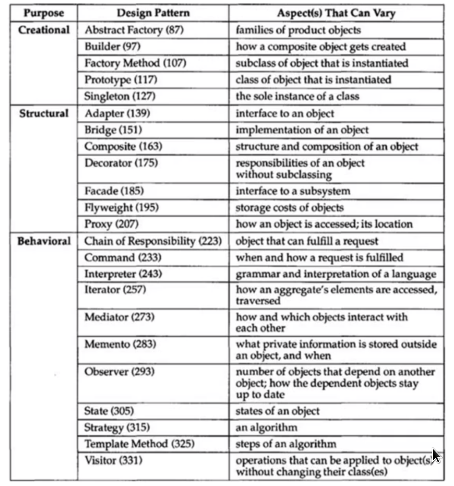

# Intro

* Design Pattern -  is a common solution to common problem in a specific context (situation).
* Design Pattern essential elements:
  1. name
  1. problem it solves in a context (situation)
  1. solution (intent)  - how to solve a problem (usually with class diagram)
  2. consequences - the results and trade-offs off applying the pattern.
     It leads to new problems and contexts, and patterns.   
    
* Patterns are related to each other

  
* Pattern classification.
  + Class patterns deal with relationships between classes 
  and their subclasses. These relationships are established through inheritance, 
  so they are static fixed at compile-time. 
  + Object patterns deal with object relationships, which can be changed at run-time and are more dynamic.

  
  
  
    
* High cohesion (высокая сполченность) - связанный код упакован в одном классе => класс хорошо решает одну поставленную задачу.
* Low coupling (слабая связанность) - блоки кода (классы) слабо связанны между собой.
* Software Design Approach (with Patterns)
  1. Нужно понять что в общем требуется сделать.
  1. Найти шаблоны, подходящие для наиболее общей цели.
  1. Выделить из найденных шаблонов те, которые ведут к новым контекстам и шаблонам.
  1. Повторить шаг 2 для получившихся контекстов.
  1. Посмотреть, как будет выглядеть ПО, при применении одного из шаблонов из шага 2, выбрать наиболее подходящий(е).  