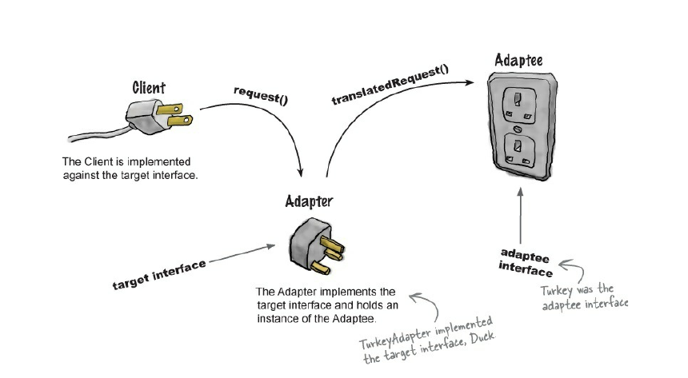
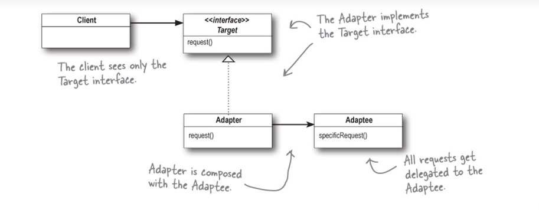
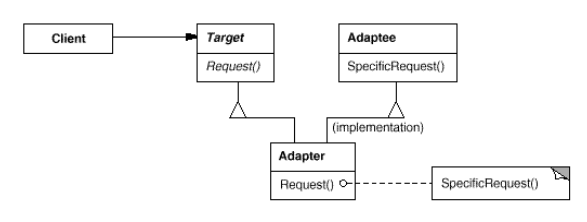

# Adapter
* Use it when:
  + Нужно подогнать интерфейс в тот интерфейс,
    который ожидает клиент.
* П: new InputStreamReader(InputStream in)
* Плюсы:
  + Дополнительно развязывает интрерфейс apadtee от клиентов.

    
* Object adapter:

    

[adapterExample](../../../src/main/java/arbocdi/dp/structural/adapter/TurkeyToDuckAdapter.java)

* Class adapter - реализуется при помощи множественного наследования.
  + Из-за использования наследования class adapter поддерживает только
    один конкретный adaptee.

