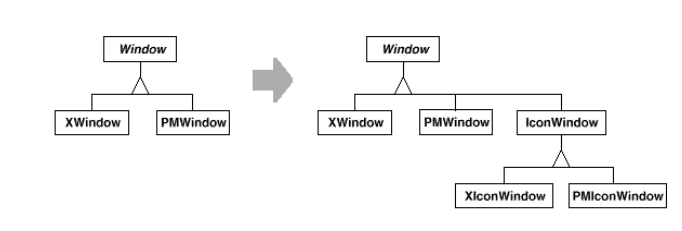
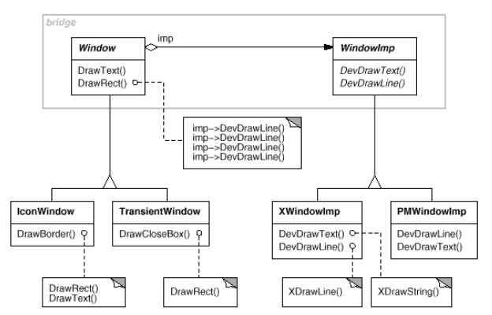
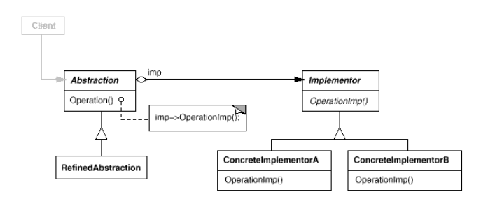
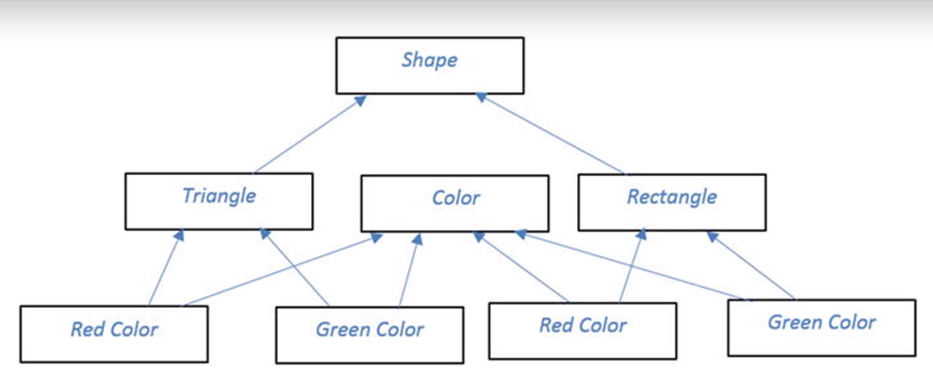

# Bridge

* Use it when:
    + Используется когда и абстракции (клиентские интерфейсы) и реализации (собственно логика работы)
      будут изменяться. Отделяет иерархию клиентских интерфейсов от иерархии реализаций.
* Отличия от adapter:
    + Adapter применяется, когда код уже написан, bridge во время разработки кода, когда будущие изменения ожидаемы.

* Пример:
  Нужно реализовать Window для X-Window System и для IBM Presentation Manager. Реализовали, а теперь понадобился новый
  класс IconWindow, для которого тоже придется писать 2 реализации:
  
  
  а теперь используем bridge:
  
  + Клиентские абстракции используют низкоуровневые методы implementors для реализации своих методов.
  + Используется принцип composition-over-inheritance: для добавления IconWindow и
    TransientWindow не нужно напрямую наследоваться от WindowImp, нужно просто делегировать.
  + Используется принцип open-closed: при добавлении нового типа окон не нужно изменять implementors.   
  + Иерархии абстракций и имплементаций могут расти независимо друг от друга.  

* Диаграмма классов:
  
  

* Participants
    + Abstraction (Window)
        + defines the abstraction's interface.
        + maintains a reference to an object of type Implementor.
    + RefinedAbstraction (IconWindow)
        + Extends the interface defined by Abstraction.
    + Implementor (WindowImp)
        + defines the interface for implementation classes. This interface doesn't have to correspond exactly to
          Abstraction's interface; in fact the two interfaces can be quite different. Typically the Implementor
          interface provides only primitive operations, and Abstraction defines higher-level operations based on these
          primitives.
    + ConcreteImplementor (XWindowImp, PMWindowImp)
        + implements the Implementor interface and defines its concrete implementation.
    
* П: Упростим иерархию классов, используя bridge:
  

[bridgeExample](../../../src/main/java/arbocdi/dp/structural/bridge/Client.java)
  