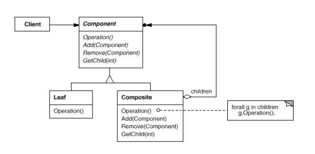

# Composite
* Определение:
  + Данные представляются в древоподобной структуре, в котрой отражены зависимости целое-часть. Составные объекты (node, узел) и листья наследуют один и тот же интерфейс.
* Use it when:
  + Объекты представимы в виде древовидной структуры с одинаковым интерфейсом.
  + Клиентам не нужно различать узлы от листьев.
+ Плюсы:
  + Клиенты становятся проще - т.к. одинаково работают с узлами и листьями.
  + Уменьшается использование памяти т.к. эелементы наследуют базовый класс, который может содержать
    разделяемые (shared) объекты.
+ Минусы:
  + Композит это тесно связанный иерархический шаблон - вновь добавляемые классы
    должны наследовать базовые.
  + Сложно добавить специфическую для определенного типа элементов операцию.
  + Сложно ограничить элементы композита по их типу т.к. все элементы наследуют один тип.
  + Нарушается принцип interface segregation т.к. листья и узлы наследуют один интерфейс (component).  
* П: Организация меню. Меню, подменю и конкретный элемент меню могут наследовать один интерфейс.    

[compositeExample](../../../src/main/java/arbocdi/dp/structural/composite/Shape.java)
