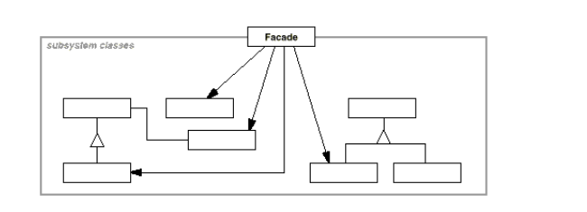

### Facade

+ Intent: Спрятать сложное взаимодействие компонентов системы за удобным для клиентов интерфейсом.
+ П: Включение ПК обычно реализовано одной кнопкой, а под капотом происходит множество действий.
+ Плюсы:
  + Делает использование системы более простым для клиентов.
  + Через интерфейс (facade) уменьшается связанность системы 
    (клиенты используют фасад а не компоненты)
  + Дополнительно структурирует систему.
  + Компоненты остаются доступными клиенту,если он в них нуждается.
    

[facadeExample](../../../src/main/java/arbocdi/dp/structural/facade/OrderFacade.java)
