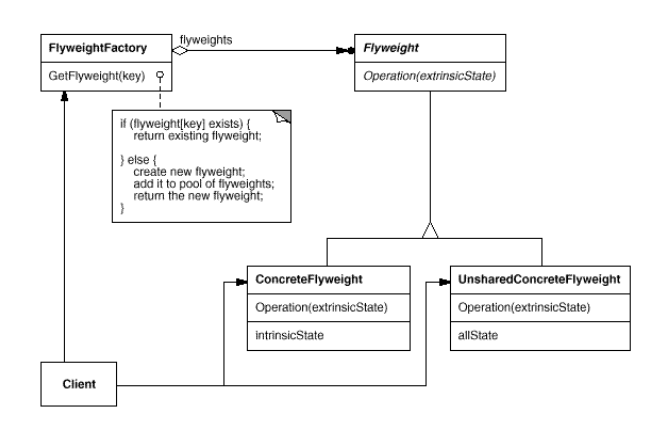
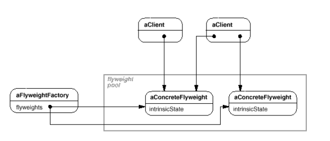

# Flyweight (легковесный)
+ Intent: Сократить количество объектов используя sharing.
+ О: Flyweight - это разделяемый объект, который может быть использован
  в нескольких контекстах.
+ П: текстовый редактор может хранить символ, шрифт и размер как внутреннее состояние,
  а позицию символа - как внешнее (и передавать его в метод отрисовки). 
+ Состояния (поля) объекта:  
  + Внутреннее (intrinsic) состояние - это состояние, хранимое внутри объекта.
  + Внешнее (extrinsic) состояние - состояние, передаваемое клиентом во время использования объекта (context).  

+ Участники:
  UnsharedConcreteFlyweigth - не все хранимые фабрикой объекты
  должны быть разделяемыми, flyweight поддерживает sharing, но
  не заставляет его использовать (например составные объекты).

[example](../../../src/main/java/arbocdi/dp/structural/flyweight/GlyphFactory.java)
  