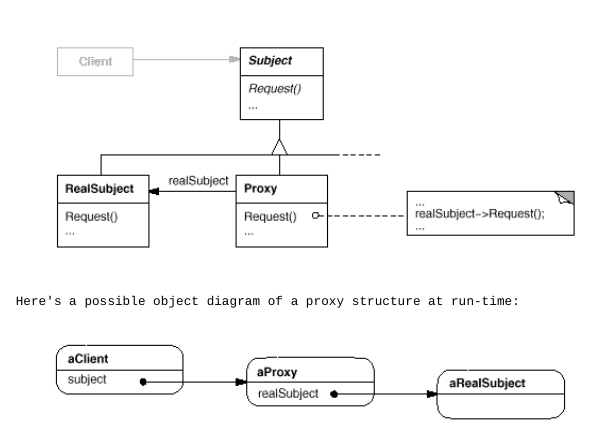

# Proxy
+ Intent: proxy - это объект-обертка, которая осуществляет некие сервисные функции при обращении к целевому объекту.
+ Виды proxy:
  + Remote Proxy: Служит для вызова методов удаленного объекта.
  + Virtual Proxy: Создает ресурсоемкий объект по запросу.
  + Service Proxy: Служит для реализации сквозной функциональности.    
+ П: Банковская карта - это прокси для доступа к счету.
+ Отличия от Decorator:
  + Proxy предназначен для осуществления сервисных функций, а декоратор
    для расширения функционала.
    
  
[example](../../../src/main/java/arbocdi/dp/structural/proxy/Browser.java)
    