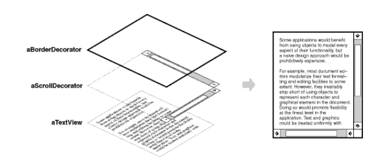
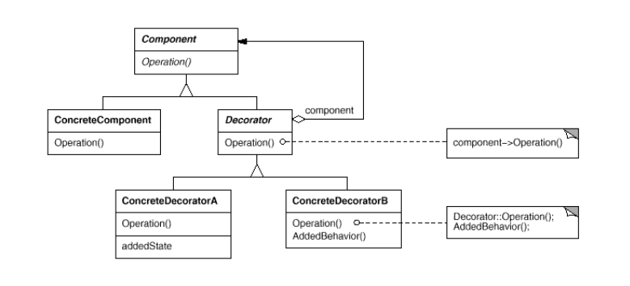

### Decorator (Wrapper)
+ Intent: добавить функционал в класс не используя наследование.
+ Плюсы:
  + Строго соответствует принципу open-closed т.к. код ConcreteComponent 
    не изменяется.
  + Можно в рантайме добавить функционал к конкретному объекту, а не всему
    классу.
  + Можно создавать цепочки декораторов, добавляя и добавляя функционал.
+ Минусы:
  + Декораторов и их цепочек может быть множество, в них
    может быть сложно разобраться и правильно использовать.

+ П: InputStreams: InputStream, BufferedInputStream, ObjectInputStream.     